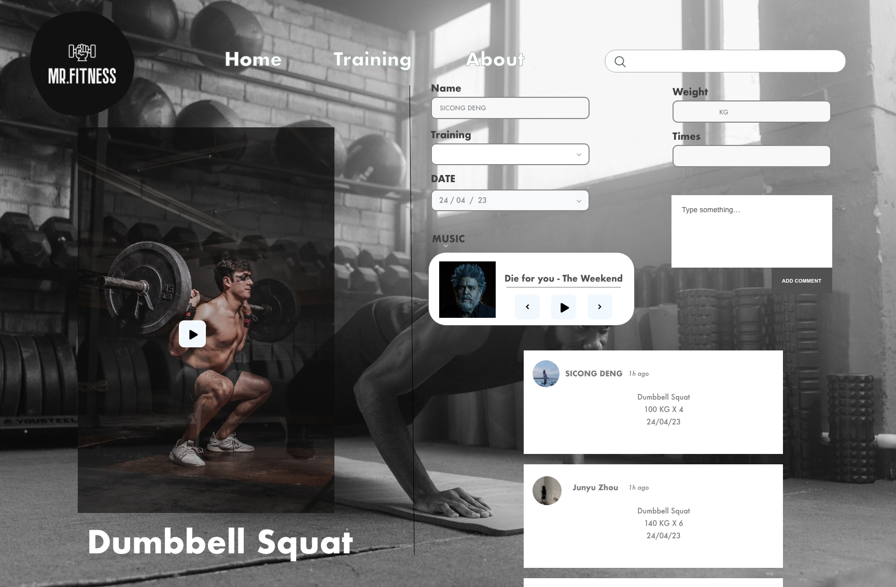
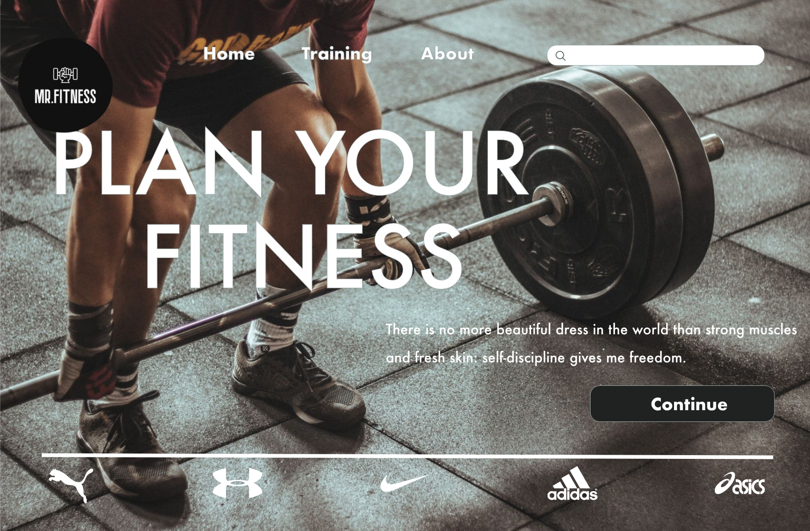
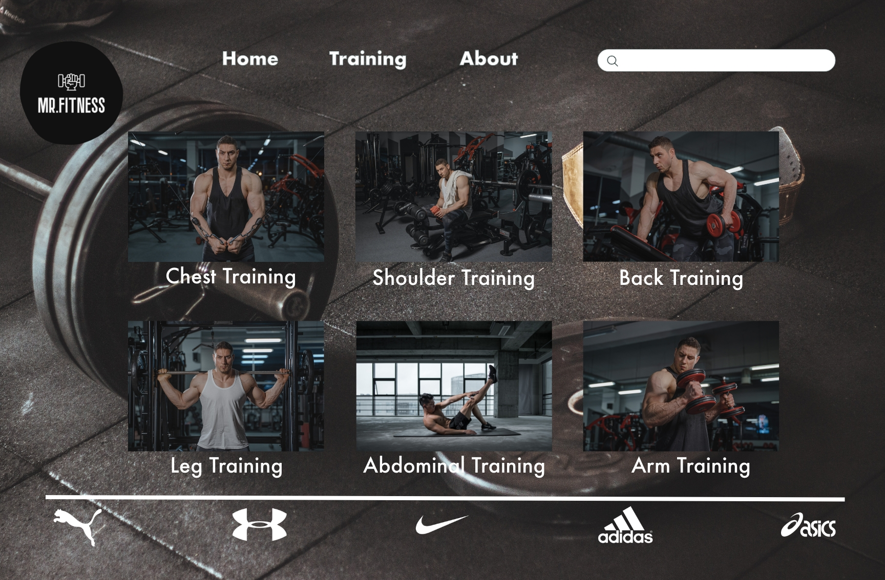

# SDEN2150-tracker SICONG DENG(490059650)

# Background 
MR.FITNESS is a fitness-focused website that provides a range of interactive features to help you achieve your fitness goals. Whether you're looking for workout routines, nutrition advice, or a community of like-minded individuals, MR.FITNESS has got you covered.

# Function
* Task List(Including:Name,Weight,Times,Date,Training)
* Vedio Player
* Category

# Devices
The web prototype is suitable for laptop(1400 x 800).

# User Feedback - Mockup - Itration
### Task List

* Change the background
* Delete "Sign in".

### Home page

* Delete avatar
* Change the color of the button

### Category

* Change the background
* Change the photography

# Final Web Application
### Home Page

* Change the color of the button
* Search bar changed to rectangle

### Training page

* Removed text box

### Task List

* Change the vedio
* Delete the music player
* The language mode will follow the open system language

# REFERRNCE
 All the pictures are from: https://www.pexels.com/zh-cn/search/gym/

 Some of the code are learn form: https://search.bilibili.com/all?keyword=Web&from_source=webtop_search&spm_id_from=333.1007&search_source=5

 Code of Tasklist are learn from tutorial;

